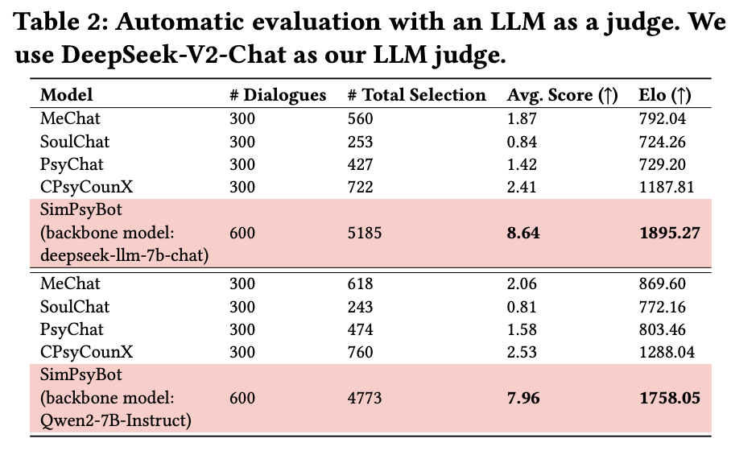
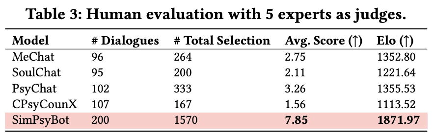

# Interactive Agents: Simulating Counselor-Client Psychological Counseling via Role-Playing LLM-to-LLM Interactions

**🔥🔥🔥 Paper**: https://www.arxiv.org/abs/2408.15787

**Model**:

- [🤗 simpsybot_Q](https://huggingface.co/qiuhuachuan/simpsybot_Q)
- [🤗 simpsybot_D](https://huggingface.co/qiuhuachuan/simpsybot_D)

## Introduction

Virtual counselors powered by large language models (LLMs) aim to create interactive support systems that effectively assist clients struggling with mental health challenges. To replicate counselor-client conversations, researchers have built an online mental health platform that allows professional counselors to provide clients with text-based counseling services for about an hour per session. Notwithstanding its effectiveness, challenges exist as human annotation is time-consuming, cost-intensive, privacy-protected, and not scalable. To address this issue and investigate the applicability of LLMs in psychological counseling conversation simulation, we propose a framework that employs two LLMs via role-playing for simulating counselor-client interactions. Our framework involves two LLMs, one acting as a client equipped with a specific and real-life user profile and the other playing the role of an experienced counselor, generating professional responses using integrative therapy techniques. We implement both the counselor and the client by zero-shot prompting the GPT-4 model. In order to assess the effectiveness of LLMs in simulating counselor-client interactions and understand the disparities between LLM- and human-generated conversations, we evaluate the synthetic data from various perspectives. We begin by assessing the client's performance through automatic evaluations. Next, we analyze and compare the disparities between dialogues generated by the LLM and those generated by professional counselors. Furthermore, we conduct extensive experiments to thoroughly examine the performance of our LLM-based counselor trained with synthetic interactive dialogues by benchmarking against state-of-the-art models for mental health.

## Release

- [2024/8/29] 🔥 We release the code, data, and models.

## Results

### Automatic Evaluation



### Human Evaluation



## Simulating Counselor-Client Interaction

```Bash
nohup python -u client_agent.py > ./client_agent.log &
nohup python -u counselor_agent.py > ./counselor_agent.log &
nohup python -u interactive_agents.py > ./interactive_agents.log &
```

## Data

After running the counselor-client interaction, we will get all simulated dialogues. We release our synthetic data `data/data.json` in the sharegpt format. Each dialogue has the same system prompt.

## Training

We select `Qwen/Qwen2-7B-Instruct` and `deepseek-ai/deepseek-llm-7b-chat` as our backbone models to fine-tune `simpsybot_Q` and `simpsybot_D`, respectively. Researchers can use our data and LLaMA-factory to fine-tune other models.

## Inference

For `simpsybot_Q`, please run the following code.

```Bash
export CUDA_VISIBLE_DEVICES=0 && python eval/simpsybot_Q.py
```

For `simpsybot_D`, please run the following code.

```Bash
export CUDA_VISIBLE_DEVICES=0 && python eval/simpsybot_D.py
```

## Evaluation

First, deploy all bots. We suggest to use 2 x NVIDIA 80G GPUs to host services.

```Bash
cd bot
CUDA_VISIBLE_DEVICES=6 nohup python -u cpsycounx.py > ./cpsycounx.log &
CUDA_VISIBLE_DEVICES=6 nohup python -u mechat.py > ./mechat.log &
CUDA_VISIBLE_DEVICES=6 nohup python -u psychat.py > ./psychat.log &
CUDA_VISIBLE_DEVICES=6 nohup python -u soulchat.py > ./soulchat.log &
CUDA_VISIBLE_DEVICES=7 nohup python -u simpsybot_D.py > ./simpsybot_D.log &
CUDA_VISIBLE_DEVICES=7 nohup python -u simpsybot_Q.py > ./simpsybot_Q.log &
```

Second, run the following code.

```Bash
nohup python -u auto_chat_LLM_as_a_judge.py > ./auto_chat_LLM_as_a_judge.log &
```

## Citation

If you find our work useful for your research and applications, please cite using this BibTeX:

```bibtex
@misc{qiu2024interactiveagents,
      title={Interactive Agents: Simulating Counselor-Client Psychological Counseling via Role-Playing LLM-to-LLM Interactions},
      author={Huachuan Qiu and Zhenzhong Lan},
      year={2024},
      eprint={2408.15787},
      archivePrefix={arXiv},
      primaryClass={cs.CL},
      url={https://arxiv.org/abs/2408.15787},
}
```
