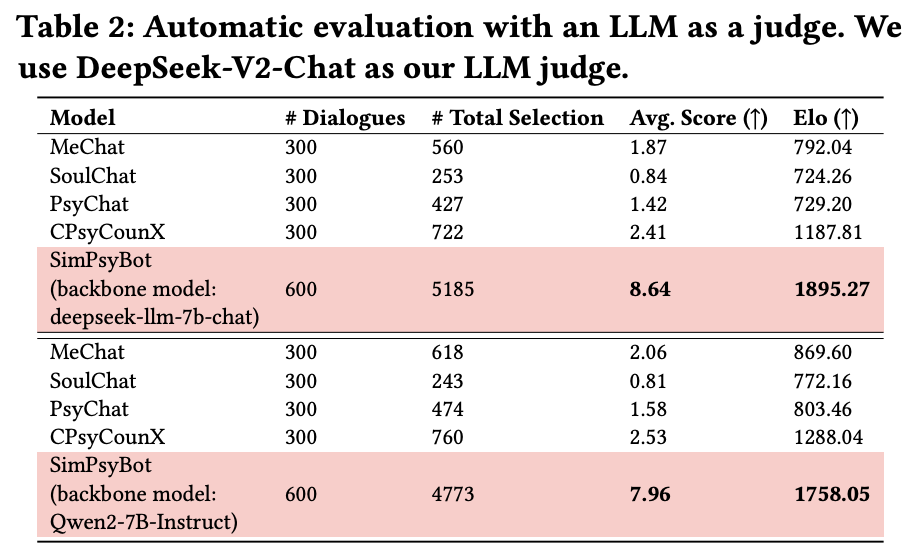
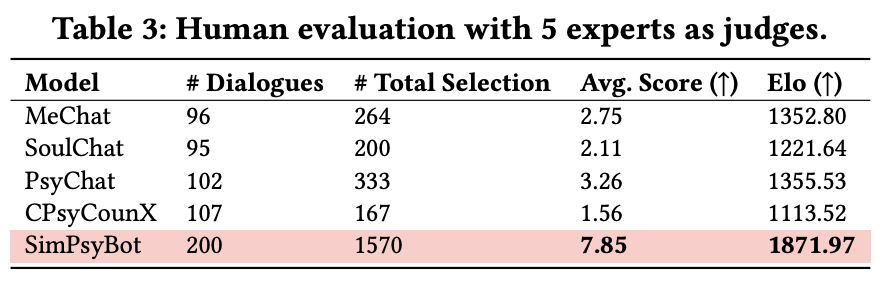

# Interactive Agents: Simulating Counselor-Client Psychological Counseling via Role-Playing LLM-to-LLM Interactions

**🔥🔥🔥 Paper**: [https://www.arxiv.org/abs/2408.15787](https://aclanthology.org/2026.starsem-conference.29.pdf)

**Model**:

- [🤗 simpsybot_Q](https://huggingface.co/qiuhuachuan/simpsybot_Q)
- [🤗 simpsybot_D](https://huggingface.co/qiuhuachuan/simpsybot_D)

## Abstrct

Creating effective dialogue systems for mental health support requires high-quality multi-turn counseling dialogue data, yet collecting real counselor-client conversations presents significant challenges, including privacy concerns, high costs, and limited scalability. We present Interactive Agents, a novel framework that simulates naturalistic counseling dialogues through controlled LLM-to-LLM interactions. The framework introduces two key innovations: (1) a personalized client agent that maintains consistent psychological characteristics throughout a session, and (2) a counselor agent that implements a theoretically grounded three-stage therapeutic model comprising the exploration, insight, and action phases. Through rigorous evaluation using both automatic metrics and professional-counselor assessments based on the Working Alliance Inventory, we demonstrate that our framework generates therapeutically valid dialogues that are comparable in quality to human-generated sessions. Models fine-tuned on our proposed synthetic dataset (SimPsyDial) achieve state-of-the-art performance in a standard pairwise chatbot-arena evaluation of LLM-based counselors. Our framework provides a scalable, privacy-preserving method for generating high-quality counseling dialogue data while maintaining professional therapeutic standards.

## Release

- [2024/8/29] 🔥 We release the code, data, and models.

## Results

### Automatic Evaluation



### Human Evaluation



## Simulating Counselor-Client Interaction

```Bash
nohup python -u client_agent.py > ./client_agent.log &
nohup python -u counselor_agent.py > ./counselor_agent.log &
nohup python -u interactive_agents.py > ./interactive_agents.log &
```

## Data

After running the counselor-client interaction, we will get all simulated dialogues. We release our synthetic data `data/data.json` in the sharegpt format. Each dialogue has the same system prompt.

## Training

We select `Qwen/Qwen2-7B-Instruct` and `deepseek-ai/deepseek-llm-7b-chat` as our backbone models to fine-tune `simpsybot_Q` and `simpsybot_D`, respectively. Researchers can use our data and LLaMA-factory to fine-tune other models.

## Inference

For `simpsybot_Q`, please run the following code.

```Bash
export CUDA_VISIBLE_DEVICES=0 && python eval/simpsybot_Q.py
```

For `simpsybot_D`, please run the following code.

```Bash
export CUDA_VISIBLE_DEVICES=0 && python eval/simpsybot_D.py
```

## Evaluation

First, deploy all bots. We suggest to use 2 x NVIDIA 80G GPUs to host services.

```Bash
cd bot
CUDA_VISIBLE_DEVICES=6 nohup python -u cpsycounx.py > ./cpsycounx.log &
CUDA_VISIBLE_DEVICES=6 nohup python -u mechat.py > ./mechat.log &
CUDA_VISIBLE_DEVICES=6 nohup python -u psychat.py > ./psychat.log &
CUDA_VISIBLE_DEVICES=6 nohup python -u soulchat.py > ./soulchat.log &
CUDA_VISIBLE_DEVICES=7 nohup python -u simpsybot_D.py > ./simpsybot_D.log &
CUDA_VISIBLE_DEVICES=7 nohup python -u simpsybot_Q.py > ./simpsybot_Q.log &
```

Second, run the following code.

```Bash
nohup python -u auto_chat_LLM_as_a_judge.py > ./auto_chat_LLM_as_a_judge.log &
```

## Citation

If you find our work useful for your research and applications, please cite using this BibTeX:

```bibtex
@inproceedings{qiu-lan-2026-interactive,
    title = "Interactive Agents: Simulating Counselor-Client Psychological Counseling via Role-Playing {LLM}-to-{LLM} Interactions",
    author = "Qiu, Huachuan  and
      Lan, Zhenzhong",
    editor = "Mohammad, Saif M.  and
      Ousidhoum, Nedjma",
    booktitle = "Proceedings of the 15th Joint Conference on Lexical and Computational Semantics (*{SEM} 2026)",
    month = jul,
    year = "2026",
    address = "San Diego, California, United States",
    publisher = "Association for Computational Linguistics",
    url = "https://aclanthology.org/2026.starsem-conference.29/",
    doi = "10.18653/v1/2026.starsem-conference.29",
    pages = "410--427",
    ISBN = "979-8-89176-413-2"
}
```
